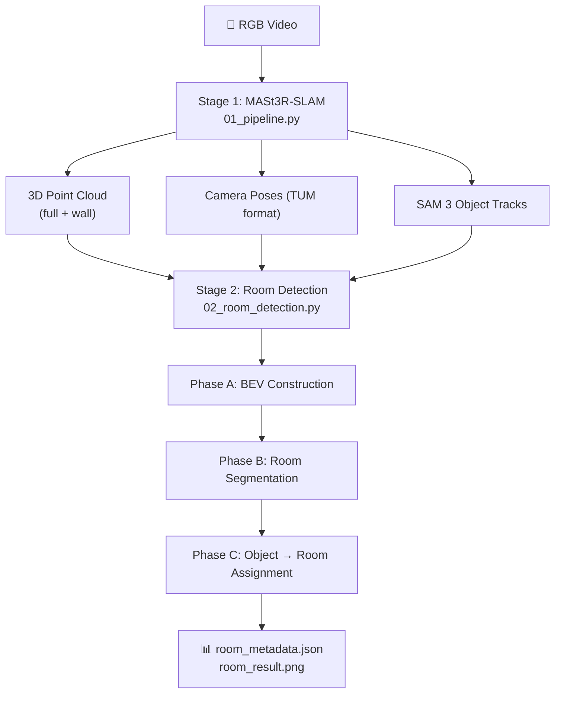

## Setup Guide

**Step 1.** First, MASt3R-SLAM has to be set up. For that go to [https://github.com/rmurai0610/MASt3R-SLAM](https://github.com/rmurai0610/MASt3R-SLAM), OR for detailed instructions follow the `MASt3R_SLAM_Setup.md` file (recommended).

**Step 2.** Download this repo -> unzip it -> keep it in the main project folder.

**Step 3.** Install `Requirement_pipeline.txt` in the same environment.

**Step 4.** Change `config_thesis.yaml` according to the path.

**Step 5.** Put the test video in your main folder root. Then run `01_pipeline.py`.

**Step 6.** Run `02_room_detection.py`.

---

# Hierarchical-Object-Tracking-Retrieval

> Monocular RGB → 3D Reconstruction → Room Segmentation → Hierarchical Object Tracking & Retrieval Pipeline

---

## Overview

This repository contains the codebase for hierarchical 3D object tracking and retrieval from **uncalibrated monocular RGB video** of indoor scenes.

The system produces:
1. **3D Dense Point Cloud** (via MASt3R-SLAM)
2. **Instance-level 3D Object Detection & Tracking** (via SAM 3 & voxel tracker)
3. **Bird's-Eye-View (BEV) Wall Map** reconstructed from point clouds
4. **Room Segmentation** on the BEV map using a novel progressive closure algorithm seeded by camera poses
5. **Hierarchical Object → Room Assignment** via surface-majority voting

---

## Architecture — Three-Stage Pipeline



---

## Pipeline Stages

### Stage 1 — SLAM + Object Detection (`01_pipeline.py`)

| Step | Description |
|---|---|
| **MASt3R-SLAM** | Produces keyframes with 3D points, confidence maps, and camera poses |
| **SAM 3** | Per-keyframe instance segmentation using text prompts (e.g., "table", "bed", "wall") |
| **Object Tracker** | Merges per-frame detections into persistent 3D object tracks via voxel overlap (IoU/IoS) |
| **Wall Accumulation** | Accumulates "wall" and "window" detections into a separate wall point cloud |

**Outputs:** `*_wall.ply`, `*_full.ply`, camera poses `.txt`, `thumbnails_metadata.json`

---

### Stage 2 — Room Detection & Object Association (`02_room_detection.py`)

- **Phase A — BEV Construction:** Floor plane RANSAC alignment (gravity alignment), Manhattan yaw correction, mid-height slice projection to binary BEV occupancy image, and denoising.
- **Phase B — Progressive Closure Room Segmentation:** SLAM camera poses provide deterministic seeds. Iterative wall dilation with Dijkstra-based seed relocation and saturation-based freezing segments rooms accurately.
- **Phase C — Object → Room Assignment:** Projects object surface points to BEV grid and assigns each object to the room with majority surface coverage (with BFS fallback for edge cases).

---

## Directory Structure

```
├── 01_pipeline.py                 # Stage 1 entrypoint (SLAM + Object Tracking)
├── 02_room_detection.py           # Stage 2 entrypoint (BEV + Room Detection + Object Assignment)
├── mast3r_slam_main.py            # MASt3R-SLAM main runner
├── mast3r_slam/                   # SLAM core library (tracking, optimization, retrieval)
├── object_tracker/                # 3D object tracker and global voxel mapping
├── supporting_files/              # Evaluation scripts and baseline comparisons
├── thirdparty/                    # External dependencies (mast3r, dust3r, in3d, eigen)
├── config/                        # Configuration files
└── logs/                          # Run logs and intermediate results
```

---

## Citation & Acknowledgements

This project builds upon:
- [MASt3R](https://github.com/naver/mast3r) / [DUSt3R](https://github.com/naver/dust3r)
- [Segment Anything (SAM)](https://github.com/facebookresearch/segment-anything)
