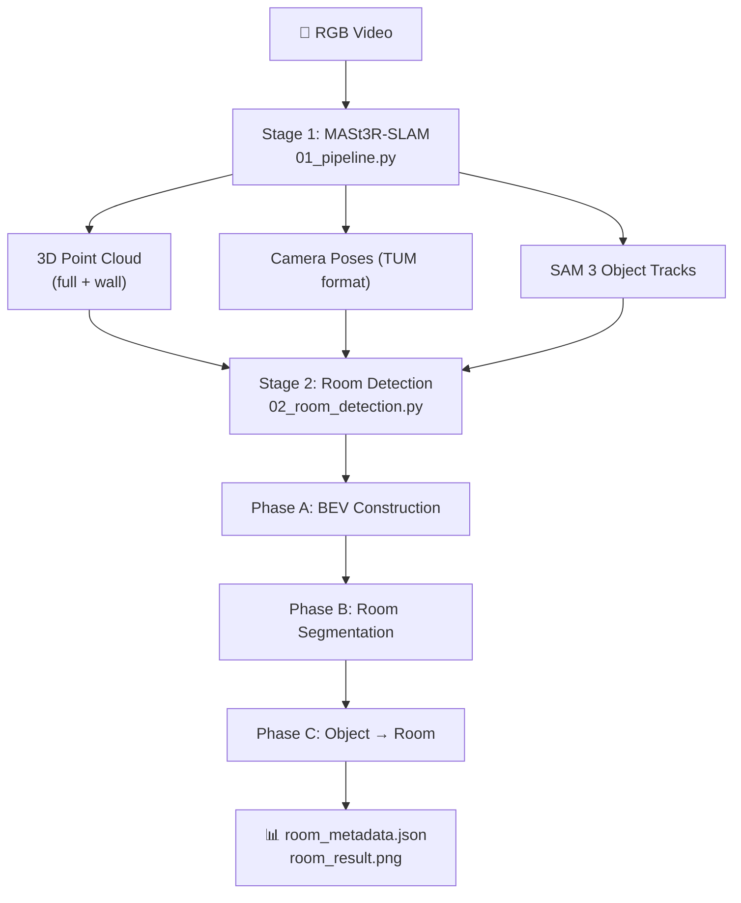

# Codebase Overview — Monocular RGB → Room Segmentation Pipeline

## What This Project Does

This is a **thesis/conference-paper codebase** that takes a **single uncalibrated monocular RGB video** of an indoor scene and produces:

1. A **3D point cloud** (via MASt3R-SLAM)
2. **Object detection and tracking** (via SAM 3)
3. A **bird's-eye-view (BEV) wall map** from the reconstructed point cloud
4. **Room segmentation** on that BEV map using a novel "progressive closure" algorithm seeded by camera poses
5. **Object → room assignment** via surface-majority voting

The key claim is that this is the **only system that recovers room-level structure from uncalibrated monocular RGB** — all prior work (HOV-SG, Hydra, ConceptGraphs, etc.) requires depth sensors, known camera intrinsics, or IMUs.

---

## Architecture — Three-Stage Pipeline

---

## Stage 1 — SLAM + Object Detection ([01_pipeline.py](file:///c:/Users/KUSHAL%20SHARMA/Documents/Thesis_project/floorplan_jul_30/floorplan_jul_30/mast3r-slam/01_pipeline.py))

| Step | What it does |
|---|---|
| **MASt3R-SLAM** | Runs in a spawned process. Produces keyframes with 3D points, confidence maps, and camera poses |
| **SAM 3** | Per-keyframe instance segmentation using text prompts (e.g. "table", "bed", "wall") |
| **Object Tracker** | Merges per-frame detections into persistent 3D object tracks via voxel overlap (IoU/IoS) |
| **Wall accumulation** | "wall" and "window" detections are accumulated into a separate wall point cloud |

**Key outputs:** `*_wall.ply`, `*_full.ply`, camera poses `.txt`, `thumbnails_metadata.json`

---

## Stage 2 — Room Detection 

### Phase A — BEV Construction (lines 82–374)

| Sub-step | Function | Purpose |
|---|---|---|
| A.1 | [phase_a_load](02_room_detection.py#L87-L96) | Load full PLY, voxel downsample, outlier removal |
| A.2 | [gravity_aligned_pts](02_room_detection.py#L100-L140) | Iterative RANSAC → find floor plane → rotate so Y=up |
| A.3 | [manhattan_align](02_room_detection.py#L144-L188) | Snap dominant wall direction to an axis (yaw correction) |
| A.6 | [bw_topdown_map](02_room_detection.py#L193-L252) | Cut at mid-height, project X/Z → binary BEV image |
| A.7 | [phase_a_denoise_bev](02_room_detection.py#L256-L293) | Remove small connected components (noise pixels) |

**Key data structure:** [BEVCalibration](file:///c:/Users/KUSHAL%20SHARMA/Documents/Thesis_project/floorplan_jul_30/floorplan_jul_30/mast3r-slam/02_room_detection.py#L19-L78) — stores the world↔pixel mapping (rotation, translation, bounds) so all subsequent phases share one coordinate system.

### Phase B — Room Segmentation (lines 377–586)

This is **the paper's contribution** — "progressive closure" room segmentation:

1. **Camera poses → seeds:** Each SLAM keyframe's position becomes a seed (no randomness). Filtered by minimum separation and wall clearance.
2. **Iterative dilation:** Walls grow by `DILATE_PX` pixels per iteration.
3. **Seed relocation:** Seeds pushed into walls get relocated via Dijkstra on free space.
4. **Saturation-based freezing:** A room "seals" when it has no free pixel that a new seed could occupy — locking its boundary permanently.
5. **Clustering + ray pruning:** Seeds in the same connected free-space component are clustered; ray-casting validates room boundaries.
6. **Dense labelling:** Final room labels via flood fill within the footprint.

The core algorithm lives in [room_detection_camera_pose.py](room_detection_camera_pose.py) (~1839 lines) and is imported by `02_room_detection.py`.

### Phase C — Object → Room Assignment (lines 589–774)

Each object's 3D points are projected onto the BEV grid. The object is assigned to whichever room contains the **majority** of its surface points — not just its centroid. This handles wall-mounted and concave objects correctly.

**Fallback:** Objects entirely inside walls use a BFS-based nearest-room map.

---

## Supporting Components

### Object Tracker ([object_tracker/])

| File | Purpose |
|---|---|
| [object_tracker.py] | `GlobalObjectMap` — merges per-frame detections into persistent tracks via voxel IoU/IoS |
| [voxel_utils.py]) | Voxelization, IoU/IoS computation, spatial queries |
| [global_map.py] | Global voxel map builder |
| [save_objects.py] | Serialization + scene graph frame generation |

### MASt3R-SLAM Core ([mast3r_slam/])

The SLAM library: frame tracking, factor graphs, retrieval database, global optimization. Uses `lietorch` for SE(3) poses. Entry point: [mast3r_slam_main.py]).

---

## HM3D Evaluation Pipeline (parent directory)

The parent directory contains a **full evaluation framework** against HM3D-Semantics scenes, benchmarked against HOV-SG:

| File | Role |
|---|---|
| [room_detection_camera_pose.py] | **The algorithm.** Camera-pose seeded progressive closure. ~1839 lines |
| [room_detection.py] | Same segmenter with FPS seeding (ablation) |
| [export_bev.py] | Floor point cloud → HOV-SG-style BEV occupancy PNG |
| [eval_objects.py] | Object → room assignment evaluation (accuracy, ARI, NMI) |
| [eval_rooms.py] | Room point-IoU metrics (Hungarian matching, P/R/F1) |
| [bev_rooms.py]| HOV-SG baseline reimplementation |

---

## Configuration

All pipeline parameters are in [config_thesis.yaml]:

| Section | Key Parameters |
|---|---|
| `mast3r_args` | Input video, SLAM config, calibration mode |
| `phase_a` | Voxel size, resolution (512), wall band, Manhattan alignment |
| `phase_b` | Seed spacing (5px), clearance (5px), dilation (2px/iter), max iterations (600), ray casting |
| `phase_c` | No parameters — surface majority voting |
| `phase_d` | VLM-based spatial predicates (Gemini/Qwen) |

---

## Results (from 10 HM3D floors)

| Method | Object Accuracy | ARI | NMI | Room mIoU |
|---|---|---|---|---|
| HOV-SG | 0.683 | 0.490 | 0.595 | 0.631 |
| **Ours** | **0.790** | **0.670** | **0.716** | **0.694** |

---

## Key Design Decisions

> [!IMPORTANT]
> The room detection algorithm is **frozen** — no modifications allowed. Infrastructure is built *around* it.

- **Camera-pose seeding** is deterministic (no RNG) and beats FPS seeding (mIoU 0.694 vs 0.668)
- **Surface majority** beats visibility voting for object assignment (ARI 0.670 vs 0.635)
- The pipeline works from **uncalibrated monocular RGB only** — depth and intrinsics are never used
- BEVCalibration is the single source of truth for all coordinate transforms
